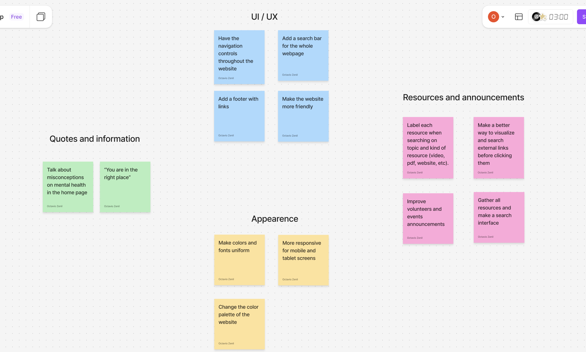
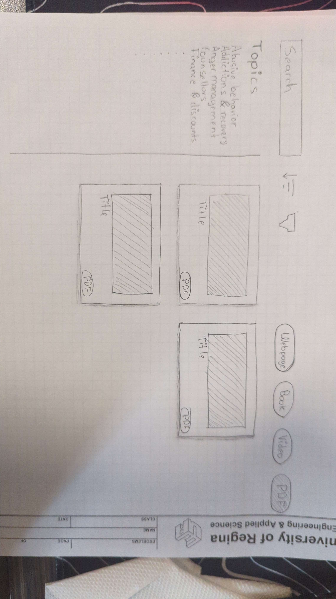

# Activity 1: Observe, frame, & brainstorm (low-fidelity)

- Empathy mappings
  - [First version](../empathy-map/octavio.md)
  - [Second version](../../Empathy%20Maps/Nyabijek%20Empathy%20Map.png)
  

- Affinity diagram
  - [Link to document :link:](https://www.figma.com/board/2krcyGs7Ed1CbjX7uKnKw3/Affinity-map?node-id=0-1&t=HChjdtU7WPePBxlh-1)
  

- Insights
  - [Link to document :link:](../../Documents/Insights_needs%20chart_document%20(i.e.%20example,%20what,%20why).docx)

- Sitemaps
  - [Nyabijek :link:](../../Site%20Maps/Nyabijek%20Site%20Map.png)
  
  - [Octavio :link:](../../Site%20Maps/octavio-zenil.png)
  
  - [About, contact and more sitemap :link:](../../Site%20Maps/Site%20map%20of%20'%20About'%20,%20'Contact'%20&%20'More'%20.png)
  

- Low fidelity prototypes
  - [Home, Contact, About and More Mobile version :link:](../../Prototypes/Low%20Fidelity%20Prototypes%20(1).pdf)
  - [Programs Desktop version :link:](../../Prototypes/Low-%20fidelity-%20prototype%20(2).jpg)
  .jpg)
  - [Resource location](../../Prototypes/low-fid-prototype-resource-location.jpg)
  

- User story map
  - [User story map document :link:](../user-story-map/user-story-map-1.pdf) 
  